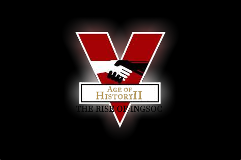
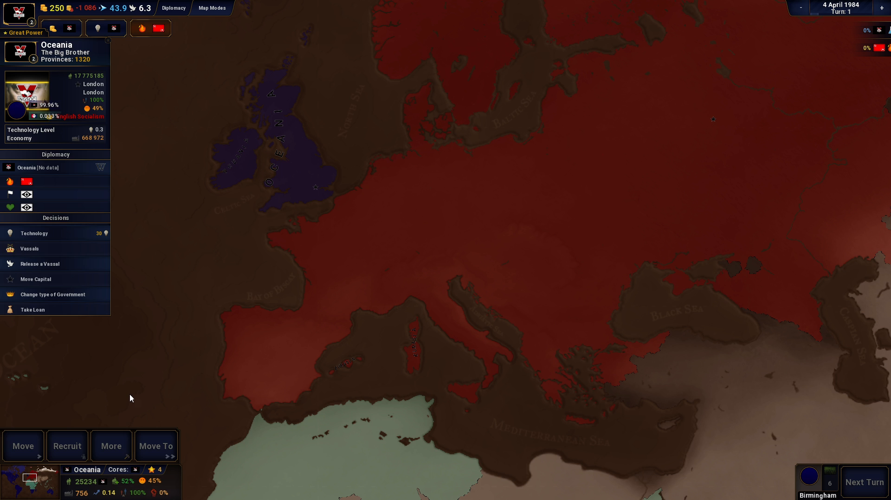

# Age of History II: The Rise of INGSOC (1984 mod)

## Description

*War is Peace* 
*Freedom is Slavery* 
*Ignorance is Strength* 

This is a mod I made for Age of History II shortly before Age of History III came out, but I am releasing it here because I want the world to see it since it is an attempt to make a political representation and alternate history on how 1984 came to be and how it will progress beyond the book.

This mod is based on the "Nineteen Eighty Four" novel by George Orwell. 
It is still in alpha and I don't really know if I will still keep working on it and I will not port it to Age of History III, but that is all subject to change.
The mod has a new scenario ("Perpetual War") and modifies the WWII scenario to portray how INGSOC and the other superstates came to be (INCOMPLETE).

Instructions on installation can be found [here (see table of contents)](about.md).

## Images

## Downloads

[Download (v0.1) :fontawesome-solid-arrow-down:](https://drive.google.com/file/d/1QW6vVYNQBrAIrHlD4tv_u8voCBbFOuWi/view?usp=sharing){ .md-button }

## Disclaimers

I do not own Age Of History brand nor am I affiliated with it in any way, shape or form. I attempt to not include any copyrighted content in the final distribution of this project, in order to not violate copyright law. For any questions, notices etc. contact me in my email: **itsnotaz@protonmail.com**

*Except as represented in this agreement, all work by itsnotAZ is provided ​“AS IS”. Other than as provided in this agreement, itsnotAZ makes no other warranties, express or implied, and hereby disclaims all implied warranties, including any warranty of merchantability and warranty of fitness for a particular purpose.*